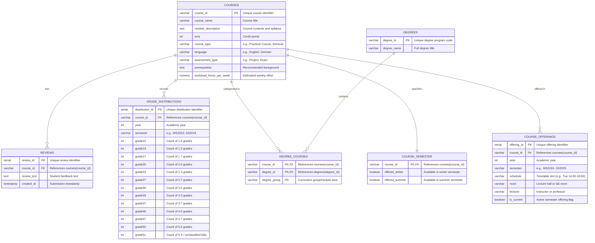

```mermaid
erDiagram
    COURSES ||--o{ REVIEWS : "has"
    COURSES ||--o{ GRADE_DISTRIBUTIONS : "records"
    COURSES ||--o{ DEGREE_COURSES : "categorized in"
    DEGREES ||--o{ DEGREE_COURSES : "contains"
    COURSES ||--|| COURSE_SEMESTER : "specifies"
    COURSES ||--o{ COURSE_OFFERINGS : "offered in"

    COURSES {
        varchar course_id PK "Unique course identifier"
        varchar course_name "Course title"
        text module_description "Course contents and syllabus"
        int ects "Credit points"
        varchar course_type "e.g., Practical Course, Seminar"
        varchar language "e.g., English, German"
        varchar assessment_type "e.g., Project, Exam"
        text prerequisites "Recommended background"
        numeric workload_hours_per_week "Estimated weekly effort"
    }

    DEGREES {
        varchar degree_id PK "Unique degree program code"
        varchar degree_name "Full degree title"
    }

    REVIEWS {
        serial review_id PK "Unique review identifier"
        varchar course_id FK "References courses(course_id)"
        text review_text "Student feedback text"
        timestamp created_at "Submission timestamp"
    }

    GRADE_DISTRIBUTIONS {
        serial distribution_id PK "Unique distribution identifier"
        varchar course_id FK "References courses(course_id)"
        int year "Academic year"
        varchar semester "e.g., WS2023, SS2024"
        int grade10 "Count of 1.0 grades"
        int grade13 "Count of 1.3 grades"
        int grade17 "Count of 1.7 grades"
        int grade20 "Count of 2.0 grades"
        int grade23 "Count of 2.3 grades"
        int grade27 "Count of 2.7 grades"
        int grade30 "Count of 3.0 grades"
        int grade33 "Count of 3.3 grades"
        int grade37 "Count of 3.7 grades"
        int grade40 "Count of 4.0 grades"
        int grade47 "Count of 4.7 grades"
        int grade50 "Count of 5.0 grades"
        int grade5x "Count of 5.X / unclassified fails"
    }

    DEGREE_COURSES {
        varchar course_id PK, FK "References courses(course_id)"
        varchar degree_id PK, FK "References degrees(degree_id)"
        varchar degree_group PK "Curriculum group/module area"
    }

    COURSE_SEMESTER {
        varchar course_id PK, FK "References courses(course_id)"
        boolean offered_winter "Available in winter semester"
        boolean offered_summer "Available in summer semester"
    }

    COURSE_OFFERINGS {
        serial offering_id PK "Unique offering identifier"
        varchar course_id FK "References courses(course_id)"
        int year "Academic year"
        varchar semester "e.g., WS2024, SS2025"
        varchar schedule "Timetable slot (e.g., Tue 14:00-18:00)"
        varchar room "Lecture hall or lab room"
        varchar lecturer "Instructor or professor"
        boolean is_current "Active semester offering flag"
    }
```